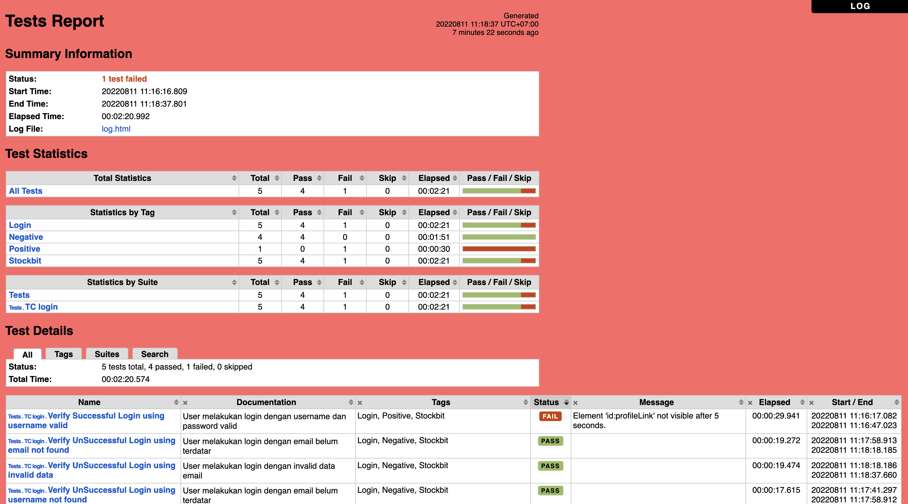

[](https://github.com/damarmustikoaji/markisa/actions/workflows/main.yml)

# Markisa
Automation Testing for Website using Robot Framework - Selenium Library

## Requirements
- Python 3.7.1
- Robot Framework
- Selenium Library
- Browser Chrome and ChromeDriver

## Getting Started
1. Clone this project
2. Install requirements (or using virtual env python) `pip install -r requirements.txt`
3. Run the test

### Command

``` 
- robot -d reports -i Stockbit tests/   | use tags
- robot -d reports tests/               | use folder test (all file)
- robot -d reports tests/check.robot    | use file test
```

### Directory Structure

    .
    Markisa
    |
    ├── data
    |     ├── data.robot
    |     └── .....robot
    ├── page_objects
    |     ├── data.robot
    |     └── .....robot
    ├── reports
    |     ├── data.robot
    |     └── .....robot
    ├── resources
    |     ├── data.robot
    |     └── .....robot
    ├── tests
    |     ├── TC.robot
    |     └── .....robot
    ├── .gitignore
    ├── README.md
    ├── requirements.txt
    ├── support.sh
    └── README.md


## Workflows
- Go to Github [Actions](https://github.com/damarmustikoaji/markisa/actions) for details

## Reports



## Testing
- stockbit.com
